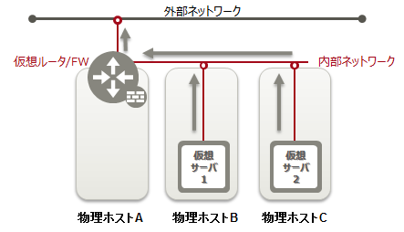
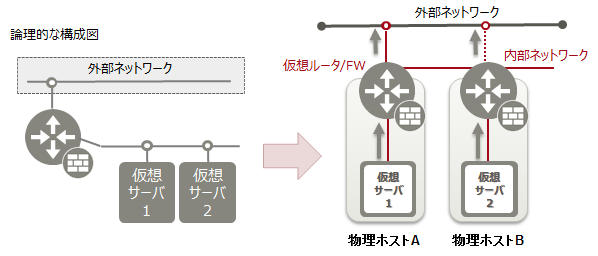
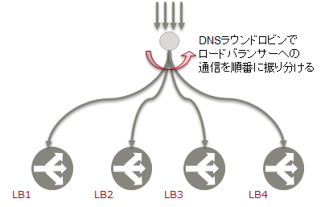
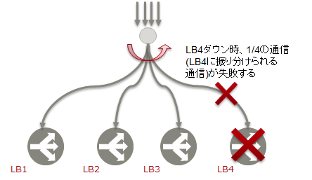
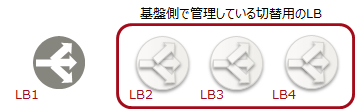
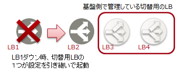

# 可用性

## 1. ネットワークインスタンス可用性

### 1-1. 仮想ルータ

#### 1-1-1. 旧リージョン

　

物理ホストAダウン　→　仮想サーバ1、仮想サーバ2ともに通信不可となります

物理ホストBダウン　→　仮想サーバ1のみに影響します

物理ホストCダウン　→　仮想サーバ2のみに影響します

仮想サーバ1、仮想サーバ2のシングルポイントが自物理ホストに加え物理ホストAも対象となってしまいます。

#### 1-1-2. 新リージョン

仮想サーバをグループ化＋Anti-Affinityを設定することで、複数の仮想サーバを別の物理ホストに配備し、合わせて仮想ネットワークも多重化します。

物理ホストAダウン　→　仮想サーバ1のみに影響します

物理ホストBダウン　→　仮想サーバ1のみに影響します

仮想サーバ1、仮想サーバ2のシングルポイントが自物理ホストのみです。

-----

### 1-2. ロードバランサー 

#### 1-2-1. 旧リージョン

多重化されているロードバランサーに対し、DNSラウンドロビンで通信の振り分け先のロードバランサーを決定します。

ロードバランサー（図中LB4）ダウン時は、そのロードバランサーに振り分けられる通信が失敗します。

#### 1-2.2. 新リージョン

切り替え先のロードバランサーはサービス基盤側で管理しています。（利用者にて意識する必要はありません。）

ロードバランサー（図中LB1）がダウンすると別のロードバランサー（図中LB2）に自動的に切り替わります。ロードバランサーの切り替わりにかかる時間は約30秒です。