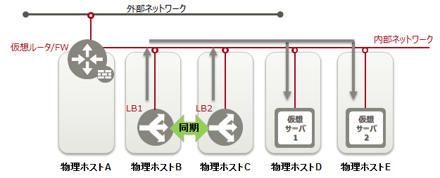
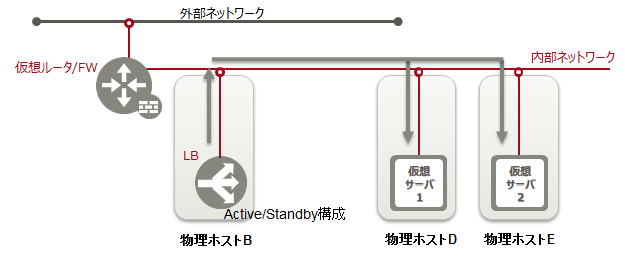

# 可用性

## 1. ネットワークインスタンス可用性

### 1-1. 仮想ルータ

#### 1-1-1. 旧リージョン

　

物理ホストAダウン　→　仮想サーバ1、仮想サーバ2ともに通信不可となります

物理ホストBダウン　→　仮想サーバ1のみに影響します

物理ホストCダウン　→　仮想サーバ2のみに影響します

仮想サーバ1、仮想サーバ2のシングルポイントが自物理ホストに加え物理ホストAも対象となってしまいます。

#### 1-1-2. 新リージョン

仮想サーバをグループ化＋Anti-Affinityを設定することで、複数の仮想サーバを別の物理ホストに配備し、合わせて仮想ネットワークも多重化します。

物理ホストAダウン　→　仮想サーバ1のみに影響します

物理ホストBダウン　→　仮想サーバ1のみに影響します

仮想サーバ1、仮想サーバ2のシングルポイントが自物理ホストのみです。

-----

### 1-2. LBaaS 

#### 1-2-1. 旧リージョン

多重化されているロードバランサーに対し、DNSラウンドロビンでアクセス先のロードバランサーを決定します。

LB1とLB2は同一Anti-Affinityグループです。

仮想サーバ1と仮想サーバ2は同一Anti-Affinityです。

たとえ物理ホストB=D、C=Eとなったとしても単一物理ホストのダウンでロードバランサーとしての機能が止まることはありません。

#### 1-2.2. 新リージョン

※仮想ルータ/FWは実際は物理ホストD、物理ホストE上で稼働しています。

LBはActive/Standby構成です。

仮想サーバ1と仮想サーバ2は同一Anti-Affinityグループです。

物理ホストBがダウンすると別のロードバランサーインスタンスに切り替わります。サービスの復旧（切替）にかかる時間は数秒～十数秒です。
