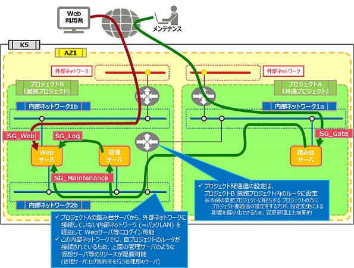

# バックLANパターン

評価ステータス：実機検証中です。

## 旧リージョン構成

## 新リージョン構成

[プロジェクト間接続のネットワーク構成に差異／注意点](../networkdesign/projectconnection.md)があるため構成変更が必要です。新リージョンでのバックLAN構成については[こちら](../networkdesign/vrouter-network.md#バックlan構成例)のバックLAN構成例をCDPとして検証中です。