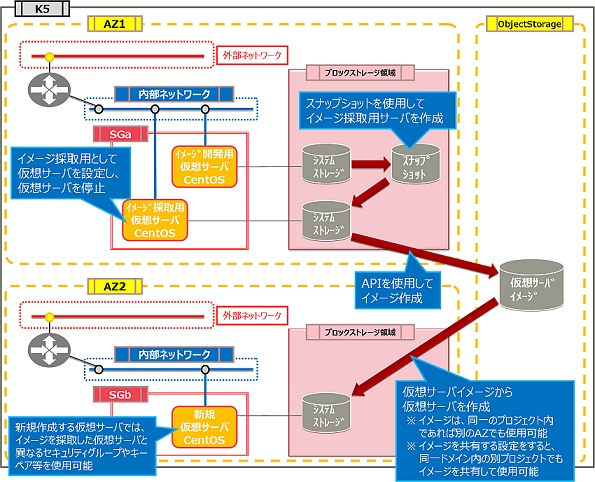

# クローニング（サーバの複製）

評価ステータス：完了（[CDP公開済](https://doc.cloud.global.fujitsu.com/lib/iaas/jp/cdp/CDP/CloneServer_region3.html)）です。

## 旧リージョン構成

------

## 新リージョン構成

同一AZ内で複製可能です。新リージョンはシングルAZのため、別のAZで使用するという概念はありません。
