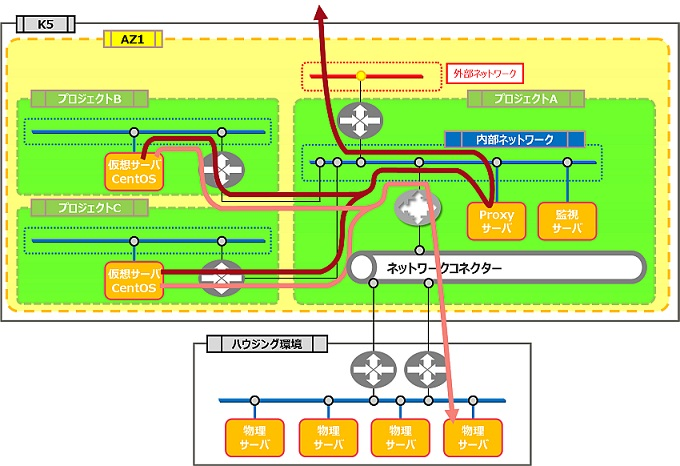

# 共通ネットワークパターン

評価ステータス：机上評価中です。

## 旧リージョン構成

## 新リージョン構成

[プロジェクト間接続のネットワーク構成に差異／注意点](../networkdesign/projectconnection.md)があるため一部構成変更が必要です。上図からの変更点としては、プロジェクトBとプロジェクトCのネットワークを直接プロジェクトAの仮想ルータに接続するCDP構成となる予定です。  
また、ネットワークコネクターが廃止されておりシンプルに外部環境と接続できます。詳しくは[こちら](../networkdesign/networkconnector.md)を参照ください。