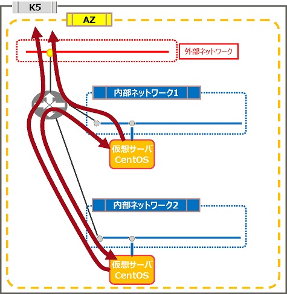
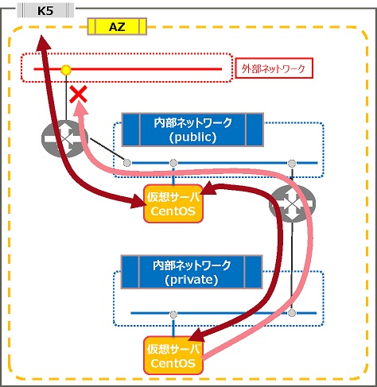
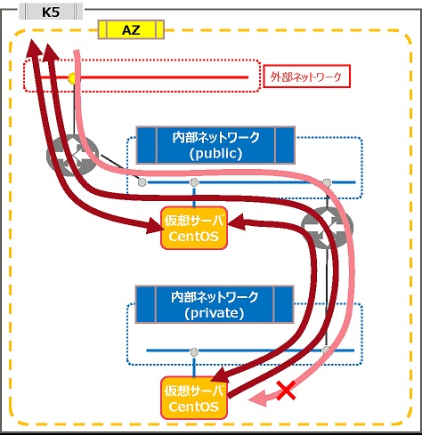

# 2階層ネットワーク構成

評価ステータス：完了（[CDP公開済](https://k5-doc.jp-east-1.paas.cloud.global.fujitsu.com/doc/jp/iaas/document/cdp/index.html#CDP/Hierarchized_Network.html)）です。

## 旧リージョン構成

### 構成1

### 構成2

### 構成3

------

## 新リージョン構成

### 構成1

同等構成が可能です。

### 構成2

同等構成が組めません。1つのネットワークに仮想ルータを2つ接続することができません。この構成は内部ネットワークに仮想ルータが2つ接続されているため、同等構成を組むことができません。

※内部の仮想ルータをIPCOM VAに変更することで同等構成とすることもできます。

### 構成3

同等構成が組めません。理由は構成2と同じです。