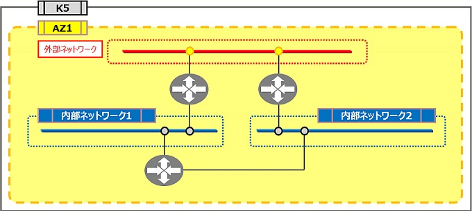
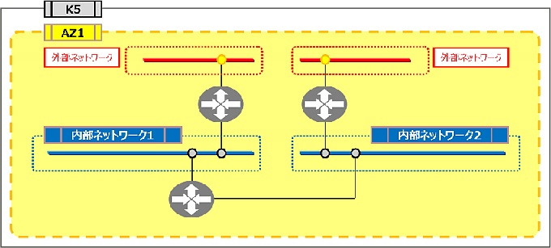

# 複数ルータ外部接続パターン

評価ステータス：机上評価済です。

## 旧リージョン構成

### 構成1

### 構成2

## 新リージョン構成

### 構成1

同等構成不可。新リージョンでは各ネットワークは1つの仮想ルータに集約されるため、1つの外部ネットワークが複数の仮想ルータに接続できません。

### 構成2

同等構成が組めません。理由は構成1と同じです。

※内部の仮想ルータをIPCOM VAに変更することで同等構成とすることもできます。