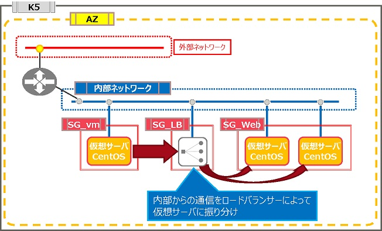
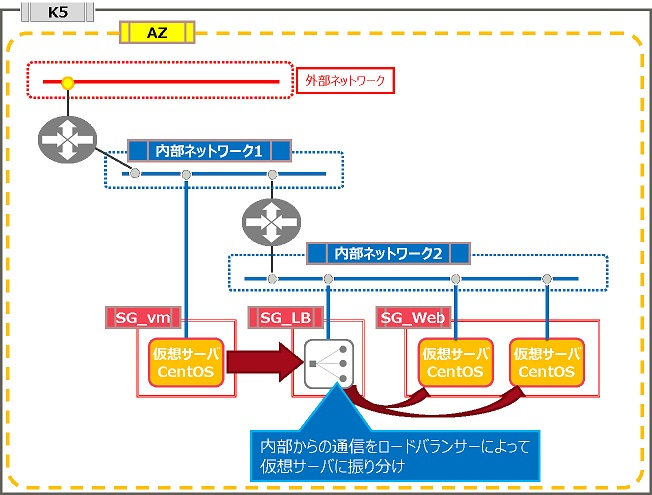

# 内部負荷分散構成

評価ステータス：完了（[CDP公開済](https://doc.cloud.global.fujitsu.com/lib/iaas/jp/cdp/CDP/Multi_Server_Internal_region3_LBaaS.html)）です。

## 旧リージョン構成

### 構成1

### 構成2

## 新リージョン構成

### 構成1

同等構成が可能です。

### 構成2

同等構成が組めません。1つのネットワークに仮想ルータを2つ接続することができません。この構成は内部ネットワークに仮想ルータが2つ接続されているため、同等構成を組むことができません。

※内部の仮想ルータをIPCOM VAに変更することで同等構成とすることもできます。
