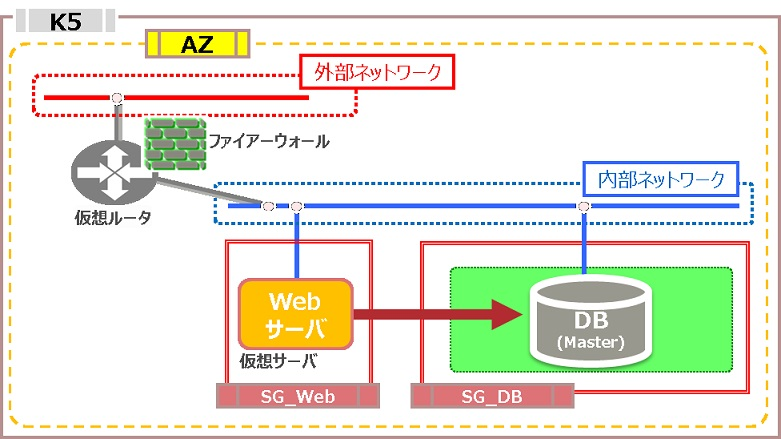
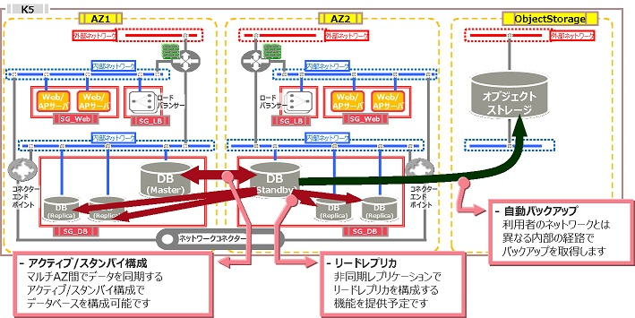

# RDB構築

評価ステータス：机上評価済です。

## 旧リージョン構成

### 構成1

 

### 構成2

## 新リージョン構成

### 構成1

2018年7月現在、新リージョンではRDBサービスの正式版が提供されていないため、CDP評価対象外です。

### 構成2

2018年7月現在、新リージョンではRDBサービスの正式版が提供されていないため、CDP評価対象外です。