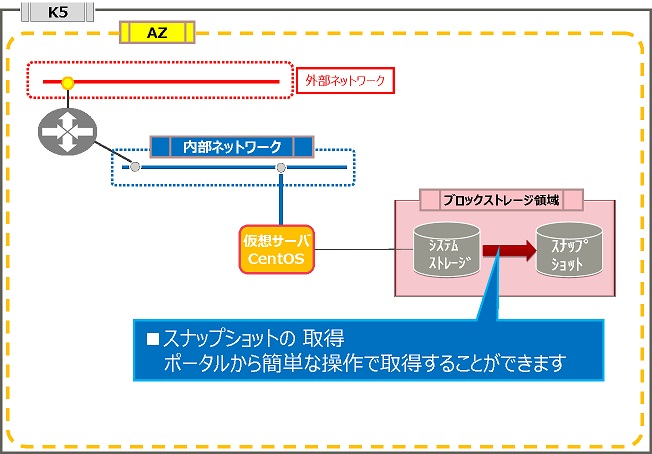
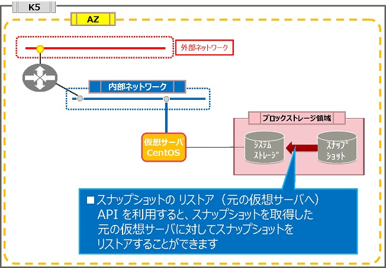

# スナップショット／リストアパターン

評価ステータス：完了（CDP公開無し）です。 

## 旧リージョン構成

### スナップショットの取得

### スナップショットのリストア

------

## 新リージョン構成

新リージョンでは、取得したスナップショットを元の仮想サーバにリストアする機能が提供されていません。取得したスナップショットの活用については、[スナップショット／複製パターン](Snapshot2.md)をご参照ください。