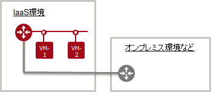

# ネットワークコネクター

## 目次  
<!-- TOC depthFrom:3 depthTo:3 withLinks:1 updateOnSave:1 orderedList:0 -->

- [1. 変更ポイント](#1-変更ポイント)
- [2. 旧リージョン](#2-旧リージョン)
- [3. 新リージョン](#3-新リージョン)

<!-- /TOC -->

---

### 1. 変更ポイント  

新リージョンには、ネットワークコネクターがありません。  

---

### 2. 旧リージョン  

AZ外のネットワークと接続する場合は、ネットワークコネクターを利用します。  
- 他のAZと接続  
- プライベート接続  

------

### 3. 新リージョン  

ネットワークコネクターを経由せず、仮想ルーターに直接接続します。  
- (シングルAZのため、他のAZとの接続はありません。)  
- プライベート接続  

---
