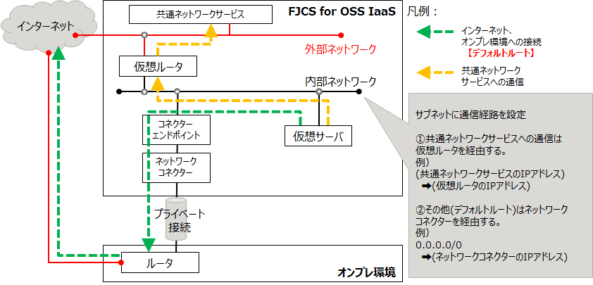

# プライベート接続

以下の変更に伴う新リージョンのネットワーク構成、および注意事項を説明します。

| カテゴリ                                             | 変更ポイント                                                               |
|:-----------------------------------------------------|:---------------------------------------------------------------------------|
| [ネットワークコネクターの廃止](networkconnector.md)  | プライベート接続はネットワークコネクターを経由せず、仮想ルーターに直接接続 |
| [仮想ルータとネットワークの接続](vrouter-network.md) | 1つのネットワークは、1つの仮想ルータのみ接続可能                           |

------

##  1. 新リージョンのネットワーク構成  

仮想サーバは1つの仮想ルータを経由して、インターネット／オンプレ環境／IaaSが提供する「共通ネットワークサービス」に接続します。  
- 仮想ルータを外部ネットワークに接続することで、デフォルトルートが自動的に設定されます。  
- オンプレ環境のルータからBGPでルーティング情報が配信されるため、仮想サーバからオンプレ環境への接続は自動的に可能です。
- 共通ネットワークサービスについて  
    - OSのライセンス認証(KMS)、アップデート適用(WSUSやyum)などのサービスを提供  
    - 利用はIaaSからのアクセスのみ  

  

【備考】オンプレ環境にあるサーバから、IaaSの仮想ルータを経由してインターネットに接続したい場合は、以下の対応を行ってください。  
- IaaSの内部ネットワークにNATサーバを配備  
- オンプレ環境のサーバは、NATサーバを経由してインターネットに接続  

------

##  2. ネットワーク構成に関する注意事項

上記の構成から、デフォルトルートをオンプレ環境側へ変更すると、共通ネットワークサービスを利用できない状態になります。  

- 「**仮想サーバはオンプレ環境経由でインターネットに接続したい**」要件がある場合に該当します。

------

#### 2.1. 新リージョンNG構成

デフォルトルートをオンプレ環境側へ変更すると、IaaSの外部ネットワークを経由した接続ができなくなります。

------

新リージョンでは「1つのネットワークは、1つの仮想ルータのみ接続可能」です。  
以下のように、仮想サーバが接続された内部ネットワークから複数の仮想ルータに接続し、通信経路を振り分ける構成はできません。  

------

#### 2.2. 旧リージョンOK構成

旧リージョンでは「1つのネットワークは、複数の仮想ルータ(ネットワークコネクターを含む)に接続可能」なため、以下の通信経路を設定できます。
- 仮想ルータを経由した共通ネットワークサービスへの通信経路  
- ネットワークコネクターからオンプレ環境を経由した、インターネットへの通信経路  

------

#### 2.3. 新リージョンOK構成  

注意事項に対する回避策は、以下の3つの中から選択してください。  
①仮想サーバで通信経路を振り分ける  
②NATサーバで通信経路を振り分ける  
③L3機能を持つ仮想サーバ(vIPCOM等)で通信経路を振り分ける  

------

**①仮想サーバで通信経路を振り分ける**

- 仮想ルータと内部ネットワークを2セット作成します。
    - A：オンプレ環境接続用
    - B：共通ネットワークサービス等への接続用
- 仮想サーバを2つのネットワークに接続します。
- 仮想サーバに通信経路を設定します。  

------

**②NATサーバで通信経路を振り分ける**

- 仮想ルータと内部ネットワークを2セット作成します。
    - A：オンプレ環境接続用
    - B：共通ネットワークサービス等への接続用
- 仮想サーバは「A：オンプレ環境接続用」のネットワークに接続します。
- NATサーバを構築し、2つのネットワークに接続します。
- NATサーバにDNAT設定を行います。
- 「A：オンプレ環境接続用」ネットワークのサブネットに通信経路を設定します。  

------

**③L3機能を持つ仮想サーバ(vIPCOM等)で通信経路を振り分ける**

- 仮想ルータと内部ネットワークを2セット作成します。
    - A：オンプレ環境接続用
    - B：共通ネットワークサービス等への接続用
- 仮想サーバは「A：オンプレ環境接続用」のネットワークに接続します。
- L3機能を持つ仮想サーバ(vIPCOM等)を構築し、2つのネットワークに接続します。
- L3機能を持つ仮想サーバ(vIPCOM等)にL3中継設定を行います。
- 「A：オンプレ環境接続用」ネットワークのサブネットに通信経路を設定します。  

------
