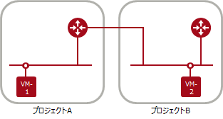
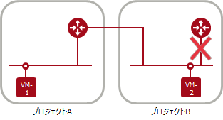

# プロジェクト間通信

ネットワーク構成や接続プロセスに差異／注意点があります。  
新リージョンの詳細については、[プロジェクト間ネットワーク接続利用ガイド](https://doc.cloud.global.fujitsu.com/lib/iaas/jp/Inter_project_connection_guide/Inter_project_connection_guide.pdf)をご覧ください。

|                  | 旧リージョン                                         | 新リージョン                                                     |
|:-----------------|:-----------------------------------------------------|:-----------------------------------------------------------------|
| ネットワーク構成 | １つのネットワークを複数の仮想ルータに接続可能です。 | １つのネットワークは１つの仮想ルータに接続するシンプル構成です。 |
| 接続プロセス     | APIを用いて利用者自身で接続です。                    | 利用申請後、サービス提供側で接続します。                         |

------

## 旧リージョンのネットワーク構成

仮想ルータに他プロジェクトのサブネット（ポート）を接続してプロジェクト間で通信します。

１つのネットワークを複数の仮想ルータに接続することができます。

------

## 新リージョンのネットワーク構成

仮想ルータに他プロジェクトのサブネット（ポート）を接続してプロジェクト間で通信します。

１つのネットワークは１つの仮想ルータへの接続です。下図ではプロジェクトBのネットワークがプロジェクトAの仮想ルータに接続している状態で、他の仮想ルータへの接続ができない状況を示しています。

