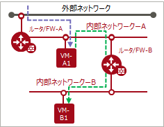
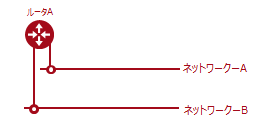
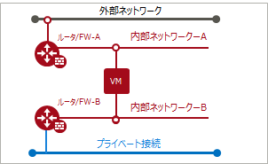
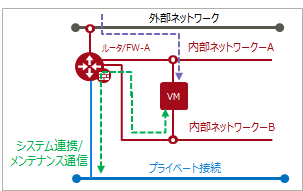
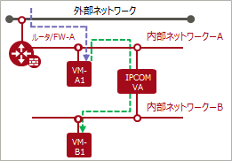
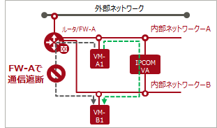
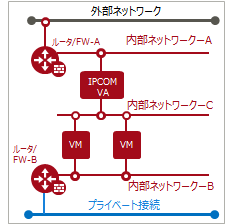
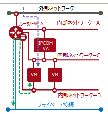

# 仮想ルータとネットワークの接続

仮想ルータとネットワークの接続の差異があります。

## 旧リージョン

１つのネットワークを複数の仮想ルータに接続可能です。

**2階層ネットワーク構成の例**

------

## 新リージョン

１つのネットワークは１つの仮想ルータに接続するシンプル構成です。

具体的な構成例については、[複数ネットワークの構成例](#複数ネットワークの構成例)、および[バックLAN構成例](#バックlan構成例)をご参照ください。また参考としてIPCOM VAを使う[参考構成例](#参考構成例)も記載しています。

### 複数ネットワークの構成例

**仮想ルータ1つで両階層ネットワークを接続する構成例**

------

### バックLAN構成例

**仮想ルータによる構成例１**

**仮想ルータによる構成例2**

------

### 参考構成例

以降はIPCOM VAを使った参考の構成例です。

**IPCOM VAで階層を分ける構成例**

**IPCOM VAで階層を分け一部通信を仮想ルータ経由とする構成例**

**IPCOM VAによるバックLAN構成例1**

**IPCOM VAによるバックLAN構成例2**

**IPCOM VAによるバックLAN構成例3**

