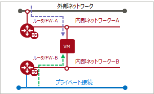

# 仮想ルータとネットワークの接続

## 目次  

<!-- TOC depthFrom:3 depthTo:3 withLinks:1 updateOnSave:1 orderedList:0 -->

- [1. 旧リージョン](#1-旧リージョン)
- [2. 新リージョン](#2-新リージョン)
- [3. 参考](#3-参考)

<!-- /TOC -->

---

### 1. 旧リージョン  

１つのネットワークは、「複数の仮想ルータ」に接続できます。  

  

---

#### 旧リージョンの構成例1  

- 「内部ネットワーク-A」は、「仮想ルータ/FW-A」と「仮想ルータ/FW-B」に接続  
  

------

#### 旧リージョンの構成例2  

- プライベート接続  
  

------

#### 旧リージョンの構成例3  

- バックLAN  
  

---

### 2. 新リージョン  

１つのネットワークは、「１つの仮想ルータ」のみに接続できます。  

  

---

#### 新リージョンの構成例1  

- 複数のネットワークを同じ仮想ルータに接続  

  

---

#### 新リージョンの構成例2  

- プライベート接続  

  

---

#### 新リージョンの構成例3  

- バックLAN接続  

  

  

---

### 3. 参考  

新リージョンで、従来と同じような構成を実現したい場合は、IPCOM VAを利用します。  

---

#### 新リージョンの参考例1  

- 「旧リージョンの構成例1」と同等構成  

  

---

#### 新リージョンの参考例2  

- バックLAN接続、プライベート接続  

  

  

  

---
