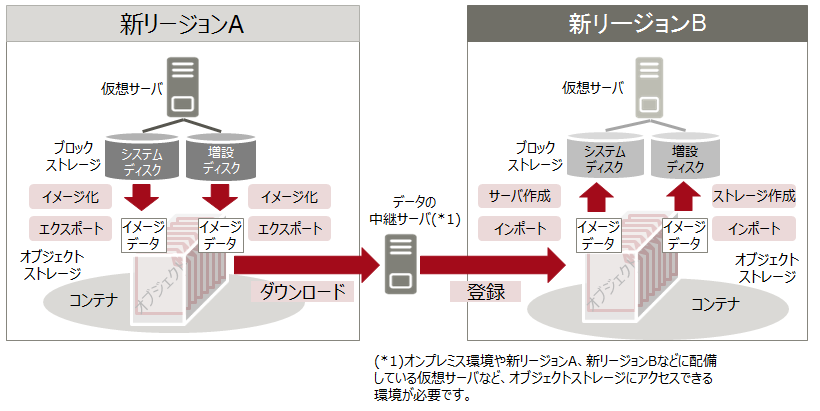

# ストレージリージョン間コピー

仮想サーバのブロックストレージを他リージョンへコピーするための、基本的な流れは次の通りです。  

1. 仮想サーバのブロックストレージをイメージ化  
2. イメージデータをエクスポートし、オブジェクトストレージに格納  
3. 中継サーバを経由して、他リージョンのオブジェクトストレージにコピー  
4. コピーしたイメージデータを用いて、仮想サーバを作成  

-----

## 旧リージョン

旧リージョンでは、増設ディスクをイメージ化できません。

-----

## 新リージョン

新リージョンでは、増設ディスクのイメージ化、およびエクスポート機能を利用できるため、他リージョンへのコピーが容易になります。  

- 他リージョンのイメージは参照できないため、リージョン毎にイメージを登録してください。  

-----

#### 補足情報

- ライセンスの都合上、システムディスクのコピーは新リージョン同士、もしくは旧リージョン同士のみです。  
新リージョンから旧リージョン、または旧リージョンから新リージョンへのコピーは実施できません。  

- 旧リージョンにおいても、以下の機能追加を予定しています。  
    - 増設ディスクのイメージ化、およびエクスポート機能  
