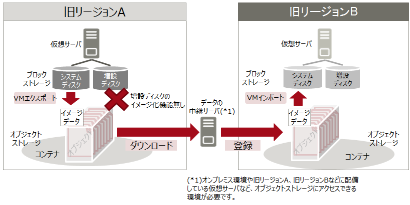

# ストレージリージョン間コピー

仮想サーバのブロックストレージデータをリージョン間でコピーし、他リージョンで復元するための基本的な流れは次の通りです。

1. 仮想サーバのブロックストレージデータをVMエクスポート機能、バックアップ機能（*1）を用いてオブジェクトストレージに格納
2. オブジェクトストレージの機能を使い、中継サーバを経由して他リージョンへデータをコピー
3. 他リージョンに格納されたデータからVMインポート機能、リストア機能を用いて仮想サーバを復元

(*1)増設ディスクのバックアップ機能は新リージョンのみの提供です。(2018年9月末予定)

## 旧リージョン

旧リージョンでは、増設ディスクをオブジェクトストレージにバックアップする機能が提供されていません。

## 新リージョン

新リージョンでは、増設ディスクをオブジェクトストレージにバックアップする機能が提供される(2018年9月末予定)ため、リージョン間でのブロックストレージデータのコピーが旧リージョンに比べ容易になります。

-----

#### 補足情報

- ライセンスの都合上、システムディスクのコピーは新リージョン同士、もしくは旧リージョン同士のみです。新リージョンから旧リージョン、または旧リージョンから新リージョンへのコピーは実施できません。

